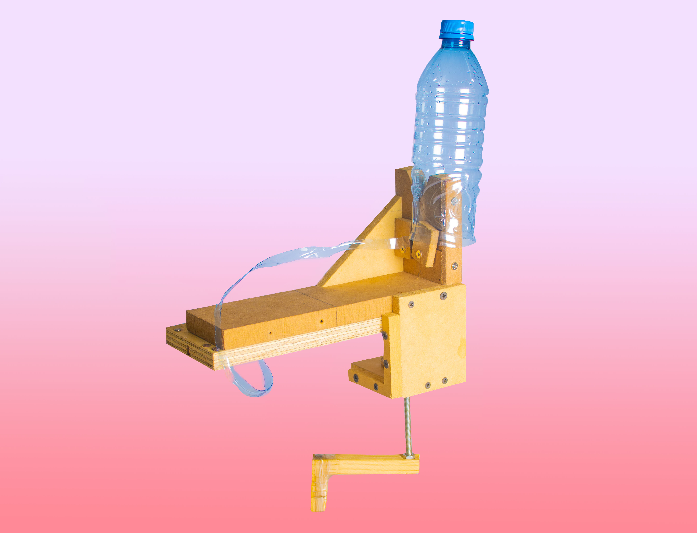

<h2 class="text-center">¿Por qué darle una segunda vida a las botellas de plástico?</h2>

  

    

      <a>
        
          <i class="fa fa-square fa-stack-2x stack-color-1"></i>
          <i class="fa fa-recycle fa-stack-1x fa-inverse"></i>
        
        
Conservación de la naturaleza, pues menos botellas llegan al relleno sanitario.

      </a>
    

  

 

  

    

      <a>
        
          <i class="fa fa-square fa-stack-2x stack-color-2"></i>
          <i class="fa fa-cut fa-stack-1x fa-inverse"></i>
        
        
Se pueden hacer distintos productos con la fibra de PET que sale de Mecatl.

      </a>
    

  

  

  

    

      <a>
        
          <i class="fa fa-square fa-stack-2x stack-color-3"></i>
          <i class="fa fa-money fa-stack-1x fa-inverse"></i>
        
        
Permite que la basura de algunos se convierta en la ganancia de otros.

      </a>
    

  

<h1 class="text-center">¿Como?</h1>

Una botella de PET tarda en degradarse aproximadamente 450 años, por lo que darle una segunda vida permitirá que se aproveche de la mejor manera. Uno de los caminos a seguir es reciclarlo para generar otras botellas; el otro, utilizarlas para generar algo más. 
Por eso Mecatl es la herramienta ideal, pues permite que  las botellas sean convertidas en una cuerda que adquiere más valor al ser vendida a las empresas de reciclado o como materia prima para hacer artesanías, como lo son sillas, bolsas o incluso sombrillas.

<h1 class="text-center"><h1>Contribuir</h1>

Si desea ser parte de un proyecto que puede contribuir a cambiar la vida de muchas familias, contactenos por medio de nuestras redes sociales o via e-mail  

   

